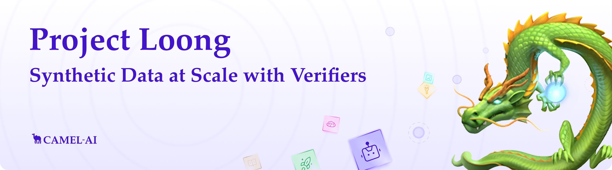
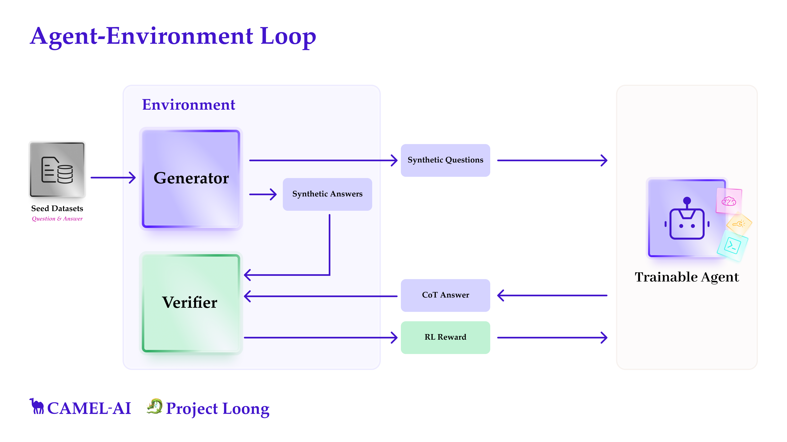
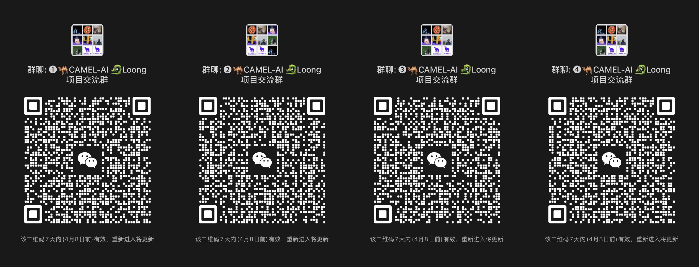

  

 

[![Discord][discord-image]][discord-url]
[![X][x-image]][x-url]
[![Reddit][reddit-image]][reddit-url]
[![Wechat][wechat-image]][wechat-url]
[![Wechat][loong-image]][loong-url]
[![Hugging Face][huggingface-image]][huggingface-url]
[![Star][star-image]][star-url]
[![Package License][package-license-image]][package-license-url]

<h4>

[Community](https://github.com/camel-ai/camel#community) |
[Cookbook](https://github.com/camel-ai/loong/tree/main/cookbooks) |
[Datasets](https://huggingface.co/datasets/camel-ai/loong) |
[Loong Blog](https://www.camel-ai.org/blogs/project-loong-synthetic-data-at-scale-through-verifiers)
[Contributing](data/CONTRIBUTING.md) |
[CAMEL-AI](https://www.camel-ai.org/)
</h4>

 

🐉 Loong Project is a collaborative effort to explore whether reasoning-capable models can bootstrap themselves from small, high-quality **seed datasets** by generating synthetic data and verifying LLM agent responses.

 

🌟 Star **Loong** on GitHub to stay updated, or join our **Initiative Program**

We invite researchers and developers to contribute seed datasets, verifiers, and ideas to help improve and extend our project. Ready to join? Click the link below to apply now.

 
  

 

## 🔍 What's in this Repo?

  

> **Agent-Environment Loop**: Project Loong leverages a feedback mechanism where a Generator creates synthetic Q&A, a Verifier evaluates answers, and a Trainable Agent learns iteratively — enabling scalable, self-improving reasoning systems.

#### 1. 📊 **Seed Datasets** — Real, human-vetted data from computable domains like math, physics, finance, etc.
#### 2. 📘 **Cookbooks** — Modular scripts for synthetic data generation, verification, and RL training loops.

 

## 📊 Seed Datasets [→](./data)
A collection of **seed datasets**, structured for generation and verification, divded for each domain. 

Each datapoint includes:
- `question`
- `final_answer`
- `rationale` (typically code)
- `metadata` (license, source, domain, difficulty, tags, anything else)

Each dataset is designed to allow automatic evaluation via **verifiers**, usually by executing the rationale code and comparing the output to the known answer.

###  Dataset Overview

The repository currently includes a total of **3,551 questions** spanning **8 diverse domains** (and growing!):

- 🧮 **Advanced Math:** 1,615 questions  
- ⚛️ **Advanced Physics:** 434 questions   
- 🧬 **Computational Biology:** 304 questions  
- 💹 **Finance:** 320 questions  
- 📈 **Graph & Discrete Math:** 179 questions  
- 🧠 **Logic:** 110 questions  
- 📐 **Mathematical Programming:** 68 questions   
- 🔒 **Security & Safety:** 521 questions

We have combined all the datasets into a single file: `data/all_seed_dataset.json`. You can also find each domain's dataset in the corresponding folder. 

> [!TIP]
> Want to contribute your own? See the [CONTRIBUTING.md](data/CONTRIBUTING.md) for seed datasets.

 

## 📘 Cookbooks [→](./cookboos)
Reusable scripts and notebooks for:

- Few-shot prompting from seed data
- Generating synthetic questions, rationales, and answers
- Running verifiers over generations
- Exporting datasets for supervised fine-tuning or RL

These pipelines allow you to condition generations on real data, verify outputs, and build consistent synthetic traces.

 

## 🧬 Contributuing to Project Loong 🐉

We're looking for:
- Seed datasets in verifiable domains
- New verifiers
- Cookbook improvements
- Experimental environments for RL

 

>
> We greatly appreciate your interest in contributing to our open-source initiative. To ensure a smooth collaboration and the success of contributions, we adhere to a set of contributing guidelines similar to those established by CAMEL. For a comprehensive understanding of the steps involved in contributing to our project, please refer to the CAMEL [Contributing Guidelines](data/CONTRIBUTING.md). 🤝
>

 

## 📜 License

- Code: [LICENSE](./LICENSE)
- Data: Per-dataset license in `metadata.json`

 

## 👥 Maintainers & Contact

Project Loong is led by the [CAMEL](https://www.camel-ai.org/) team, with contributors from across the open-source AI research community.

If you're keen on exploring new research opportunities or discoveries with our platform and wish to dive deeper or suggest new features, we're here to talk. Feel free to get in touch for more details at camel-ai@eigent.ai.

 

- Join us ([*Discord*](https://discord.camel-ai.org/) or [*WeChat*](assets/wechat.jpg)) in pushing the boundaries of finding the scaling laws of agents. 
- Join WechatGroup for further discussions!

 

  

[discord-image]: https://img.shields.io/discord/1082486657678311454?logo=discord&labelColor=%20%235462eb&logoColor=%20%23f5f5f5&color=%20%235462eb
[discord-url]: https://discord.camel-ai.org/
[huggingface-image]: https://img.shields.io/badge/%F0%9F%A4%97%20Hugging%20Face-CAMEL--AI-ffc107?color=ffc107&logoColor=white
[huggingface-url]: https://huggingface.co/datasets/camel-ai/loong
[loong-image]: https://img.shields.io/badge/WeChat-ProjectLoong-brightgreen?logo=wechat&logoColor=white
[loong-url]: ./assets/wechatgroup.jpg
[package-license-image]: https://img.shields.io/badge/License-Apache_2.0-blue.svg
[package-license-url]: https://github.com/camel-ai/loong/blob/main/LICENSE
[reddit-image]: https://img.shields.io/reddit/subreddit-subscribers/CamelAI?style=plastic&logo=reddit&label=r%2FCAMEL&labelColor=white
[reddit-url]: https://www.reddit.com/r/CamelAI/
[star-image]: https://img.shields.io/github/stars/camel-ai/loong?label=stars&logo=github&color=brightgreen
[star-url]: https://github.com/camel-ai/loong/stargazers
[wechat-image]: https://img.shields.io/badge/WeChat-CamelAIOrg-brightgreen?logo=wechat&logoColor=white
[wechat-url]: ./assets/wechat.jpg
[x-image]: https://img.shields.io/twitter/follow/CamelAIOrg?style=social
[x-url]: https://x.com/CamelAIOrg
